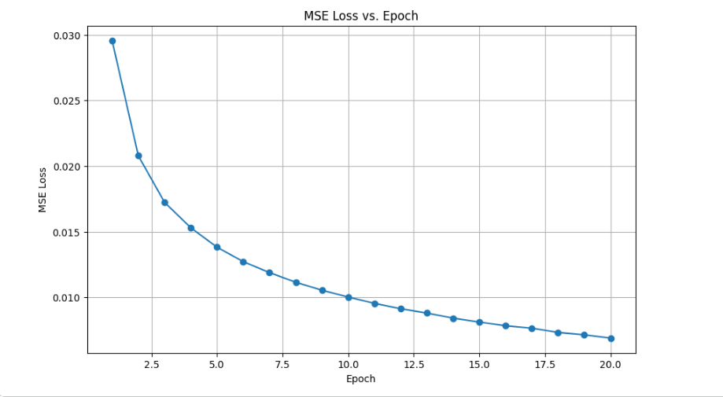
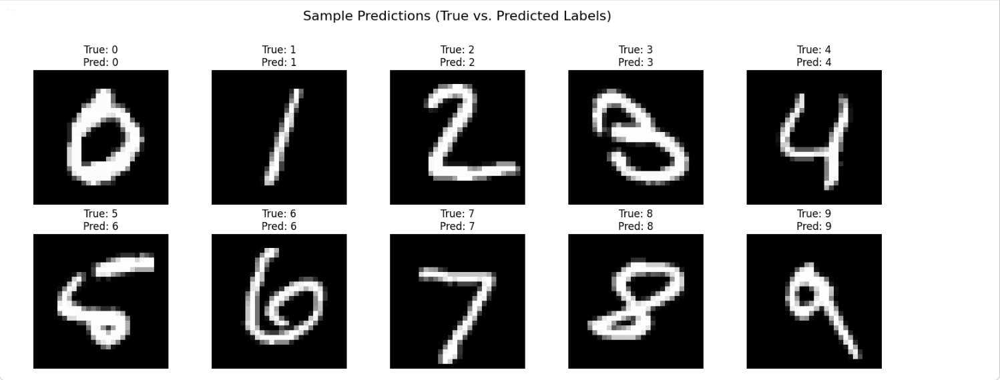

# 📘 MVC Project: Multilayer Perceptron

## 👤 Student Information
- **Name:** Muhammad Hasnain Farooq  
- **Roll No:** 25i0039
- **Section:** AI-A
- **Date:** 29th March, 2026

---

## 📌 Overview

This project presents a complete implementation and analysis of a **Multilayer Perceptron (MLP)**, covering both:

- Manual computation (forward pass, loss, backpropagation)
- Full-scale implementation on the **MNIST dataset**

The goal is to build strong intuition for neural networks by bridging **mathematical understanding** with **practical implementation**.

---

## 🧠 Key Concepts Covered

- Forward Propagation  
- Mean Squared Error (MSE) Loss  
- Backpropagation (Gradient Computation)  
- Optimization Techniques:
  - Stochastic Gradient Descent (SGD)
  - Mini-Batch Gradient Descent
  - Momentum
  - Nesterov Accelerated Gradient (NAG)

---

## ⚙️ Network Architecture

### Manual Model
- Input Layer: 2 neurons  
- Hidden Layer 1: 2 neurons (Sigmoid)  
- Hidden Layer 2: 2 neurons (Sigmoid)  
- Output Layer: 1 neuron (Sigmoid)  

### MNIST Model
- Input Layer: 784 neurons  
- Hidden Layer 1: 128 neurons  
- Hidden Layer 2: 64 neurons  
- Output Layer: 10 neurons  

---

## 📊 Training Configuration

- Learning Rate: **0.1**  
- Epochs: **20**  
- Batch Size: **32**  
- Weight Initialization: Uniform **[-0.5, 0.5]**  
- Bias Initialization: **0**  
- Input Normalization: **[0,1]**

---

## 📉 Results

### Final Performance
- **Training Loss:** 0.0069  
- **Test Accuracy:** 95.54%  

---

## 📈 Loss Curve

---

## 🔢 Sample Predictions

---

## 🧪 Observations

- SGD showed consistent loss reduction in manual implementation  
- Mini-batch training introduced slight fluctuations but improved stability  
- Optimizer comparison showed minimal differences due to small dataset  
- MNIST results confirm strong learning capability of MLP  

---

## 🧩 Key Learnings

- Backpropagation is essential for efficient gradient computation  
- Activation functions introduce non-linearity  
- Proper training strategy significantly impacts performance  

---

## 🏁 Conclusion

This project demonstrates both theoretical and practical aspects of neural networks. The achieved accuracy of **95.54%** validates the effectiveness of the implemented MLP model.

---

## 📚 References

1. Goodfellow, I., Bengio, Y., Courville, A.  
   *Deep Learning*. MIT Press, 2016  

2. LeCun, Y., Bottou, L., Bengio, Y., Haffner, P.  
   *Gradient-Based Learning Applied to Document Recognition*. IEEE, 1998  
